# Demos

Curated runnable showcases — one file per feature. Each demo exercises
one capability in isolation so we (and anyone reading the codebase) can
see it work end-to-end. The full e-commerce diagram in `architecture.py`
doubles as the quickstart.

For every demo, this folder ships:

- `<name>.py` — the source (the canonical artefact).
- `html/<name>.html` — a CDN-rendered interactive copy (~10–25 KB).
  Open in any browser with internet to pan / zoom the diagram.
- `img/<name>.png` — a static preview embedded below so GitHub shows
  the diagram without anyone having to run or download anything.

## How to run / regenerate

```bash
python docs/demos/<name>.py
```

The committed `html/` and `img/` artefacts are pre-generated; running
the script locally produces a fresh `.html` you can throw away.

---

## architecture — full e-commerce C4-container view

`SystemMap` with 16 components, 5 layers, 19 connections. Stresses
layout (Sugiyama), routing (A\* with congestion / overlap avoidance),
off-page connectors, and group swim-lanes.

[source](architecture.py) · [interactive HTML](html/architecture.html)

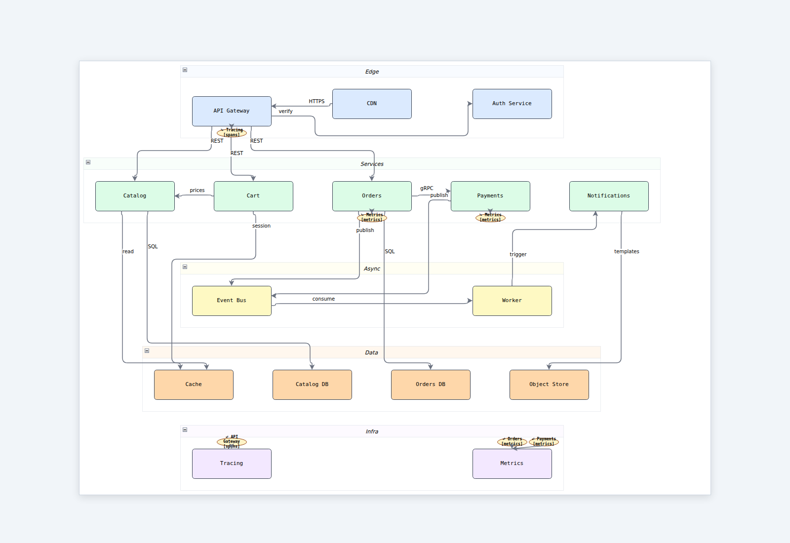

---

## tree — top-down hierarchy via TreeMap

Org chart with 13 nodes. Reingold-Tilford layout: each subtree gets the
horizontal width its leaves need; parents centre over children.

[source](tree.py) · [interactive HTML](html/tree.html)

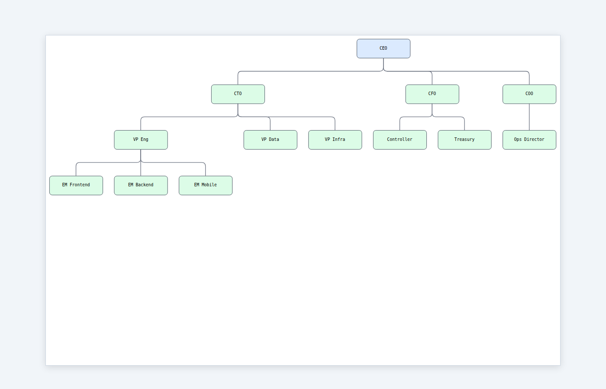

---

## multi_view — Architecture Description split into focused views

The same e-commerce system as two separate views (`storefront`,
`payments`). A `connect()` from one view's component to another's
becomes an auto-detected stub (dashed/faded box) in the secondary view.

[source](multi_view.py) · [interactive HTML](html/multi_view.html)

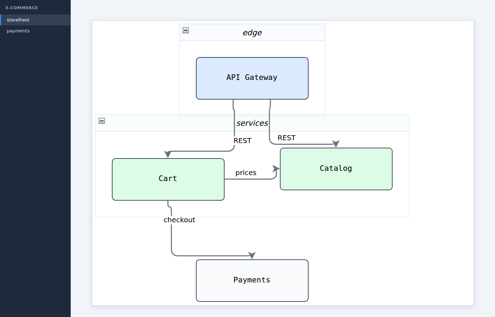

---

## qualities — ISO 25010 quality badges

Components and connections carry typed quality attributes. The renderer
shows coloured letter badges for any quality with `criticality` of
`high` or `critical`. Colour key: S=security, P=performance,
R=reliability, M=maintainability, etc. (see
[`../ontology/qualities.md`](../ontology/qualities.md)).

[source](qualities.py) · [interactive HTML](html/qualities.html)

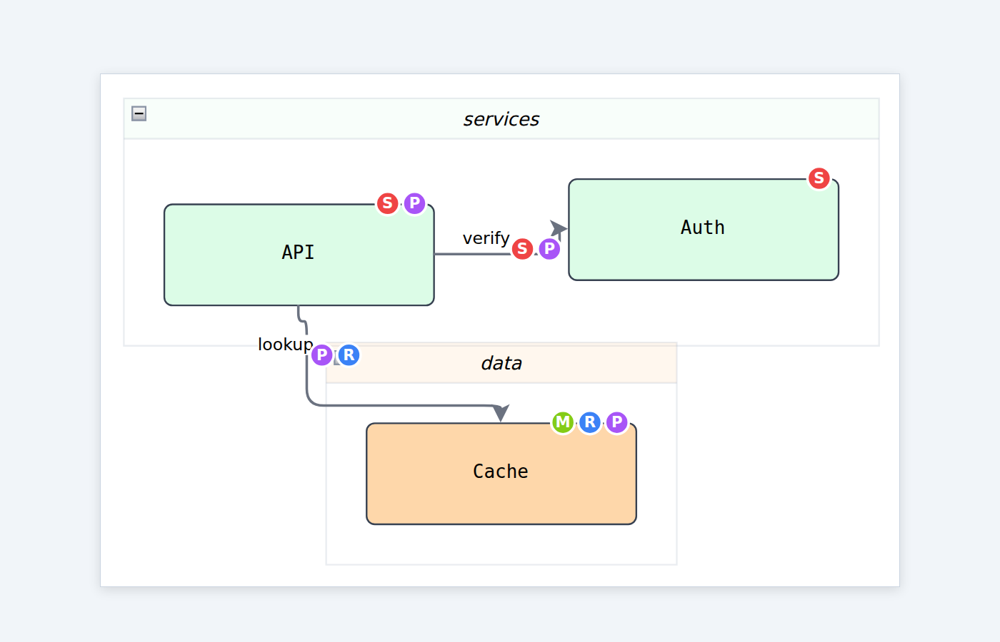

---

## trace_matrix — trace links as both overlay and table

Trace links are SysML-vocabulary semantic edges across models
(`realizes`, `depends_on`, `documents`, …). sysatlas renders them in
two ways: dashed purple **overlay edges** inside each view (they don't
enter the Sugiyama layout) and a standalone **HTML matrix** for
audit-style review.

[source](trace_matrix.py) ·
[diagram with overlays](html/trace_matrix.html) ·
[matrix table](html/trace_matrix_table.html)

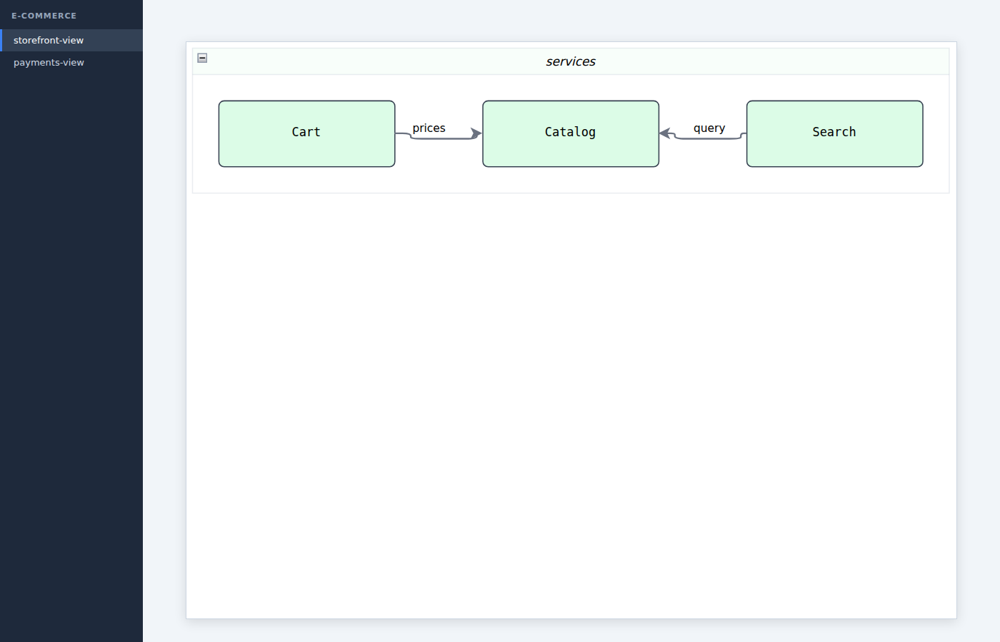

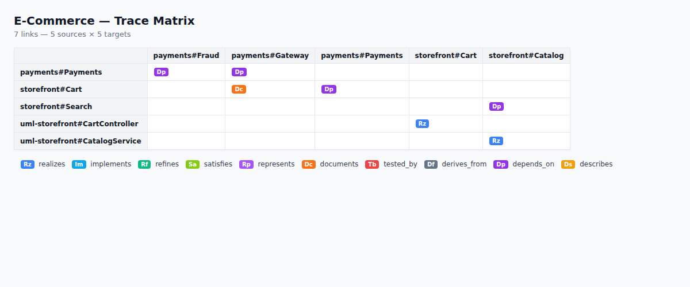

---

## sequence — UML sequence diagram via SequenceMap

Eight messages across five actors (User/Web/Orders/Fraud/DB). Vertical
lifelines, activations on each actor, and an `opt` frame wrapping the
fraud-check branch. Reply messages render as dashed arrows.

[source](sequence.py) · [interactive HTML](html/sequence.html)

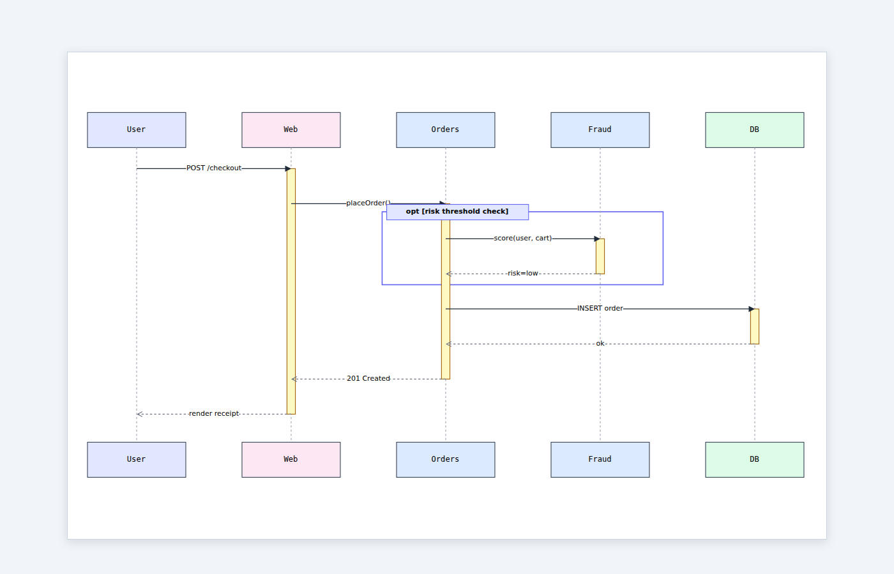

---

## er — Entity-Relationship diagram via ERMap

Four-entity e-commerce schema (Customer, Order, LineItem, Product).
LineItem is marked as a weak entity (yellow header, bolder border).
Keys are marked with a key glyph; required attributes with a filled
dot. Each relationship line carries source/target cardinality and a
verb-phrase label.

[source](er.py) · [interactive HTML](html/er.html)

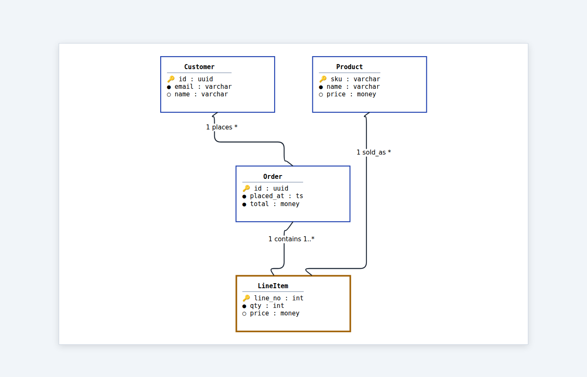

---

## state_machine — state chart via StateMap

Order-lifecycle state machine: Pending → Paid → Shipped → Delivered,
with a Cancelled side-branch. Initial pseudo-state is a filled circle;
final is a bullseye. Each state carries optional `entry/do/exit`
actions, and transitions render as `event [guard] / action`.

[source](state_machine.py) · [interactive HTML](html/state_machine.html)

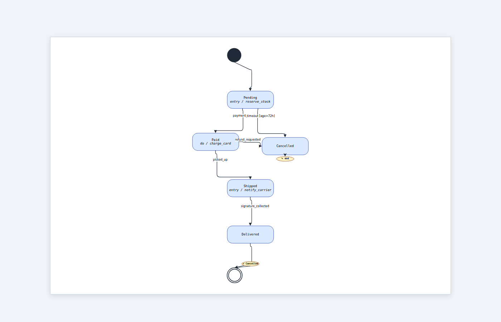

---

## uml_class — UML class diagram via ClassMap

Payments domain showing all six relation kinds: inheritance (closed
triangle), implementation (dashed + triangle), composition (filled
diamond), aggregation (hollow diamond), association (plain), and
dependency (dashed arrow). Stereotypes `«abstract»`/`«interface»`
appear in the header; attributes and methods get visibility glyphs
(+/-/#/~).

[source](uml_class.py) · [interactive HTML](html/uml_class.html)

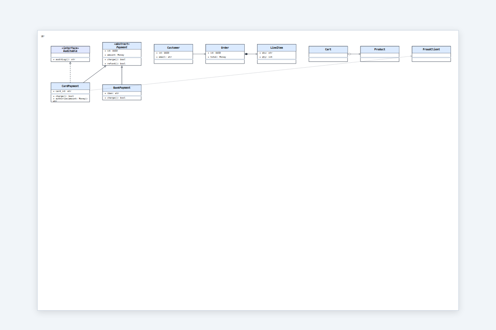

---

## hub — hub-and-spoke strategy (read/write loops around an integrating model)

Drop the Sugiyama stack: `strategy="hub"` places one central component
("hub") with consumers stacked on the right, sources on the left,
interfaces on top, and external systems at the bottom. Five reserved
layer names drive placement (`interfaces`, `write`, `hub`, `read`,
`external`). See
[`../ontology/architecture.md`](../ontology/architecture.md#layout-strategy).

[source](hub.py) · [interactive HTML](html/hub.html)

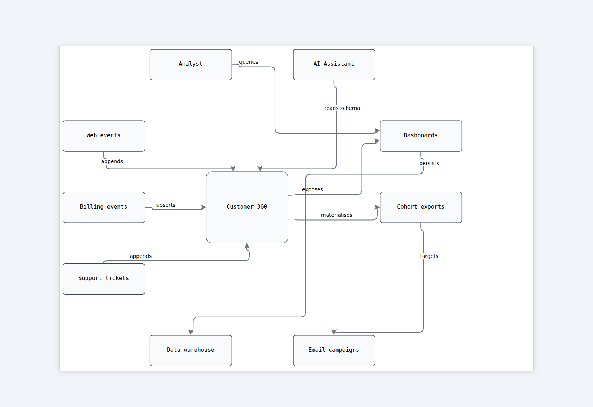

---

## Distinction from neighbouring directories

| Directory | Purpose |
|---|---|
| `docs/demos/` | Feature-by-feature showcase. Each script focuses on one capability. |
| `docs/reflection/` | sysatlas-diagrams-of-sysatlas (dog-fooding). |
| `docs/ontology/` | Per-ontology specs (Pydantic schemas + semantics). |
