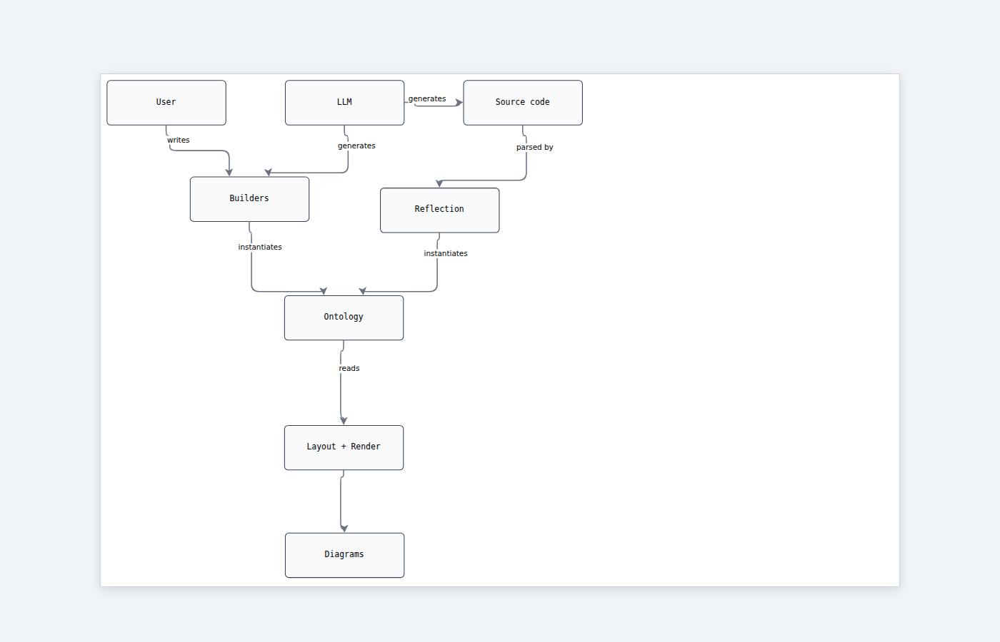
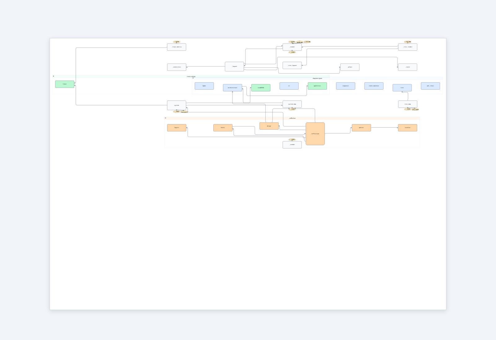

# Reflection

Diagrams of sysatlas itself, built by sysatlas.

Self-referential dog-fooding: every concept the library claims to model —
components, layers, multi-view splits, trace links, quality attributes —
should be expressible *about sysatlas*. These diagrams are also the
honest acceptance test for the **backward flow**: if `sysatlas.reflect()`
can produce a usable diagram of its own source, the API works.

## Files

| File | What it diagrams | How |
|---|---|---|
| [`loops.py`](loops.py) → [`loops.html`](loops.html) · [PNG](img/loops.png) | sysatlas as read/write loops around its ontology. The *conceptual* view: what sysatlas is. | Hand-authored (forward flow). |
| [`module-map.py`](module-map.py) → [`module-map.html`](module-map.html) · [PNG](img/module-map.png) | sysatlas's internal module dependency graph. The *literal* view: what its files import. | `sysatlas.reflect()` (backward flow). Hints loaded from `sysatlas/sysatlas.json`. |

### The conceptual view



Three parties feed the ontology — User, LLM, and Source code. Two
symmetric write paths reach it: **forward** through the builders
(user/LLM writing code), **backward** through reflection (parsing
existing code). The ontology hub is drained by layout + render into
diagrams. That symmetry — forward / backward writing into the same
shared grammar — *is* the read/write loop.

### The literal view



### Why this exists

- **Pressure test the API** — if drawing sysatlas in sysatlas is awkward,
  the API is wrong. The diagrams here are the most honest acceptance
  test we have.
- **Worked example of the backward flow** — `module-map.py` is the
  end-to-end recipe a coding assistant should follow after any
  structural code change: reflect, save, commit alongside the code.
- **Documentation** — the architecture / pipeline / ontology hierarchy
  is easier to grok visually than from prose.

### How to regenerate

```bash
python docs/reflection/loops.py        # conceptual view (hand-authored)
python docs/reflection/module-map.py   # literal module dependency graph
```

Re-run `module-map.py` after any module add / remove / rename. The
`loops.py` view is stable and only needs regenerating when the
conceptual story changes (new actors, new flow stages). The committed
`module-map.html` is whitelisted in `.gitignore` so updates show up in
diffs alongside the source change.

### Conventions

- One `.py` per diagram.
- Generated `.html` files for reflection diagrams are **committed**
  (whitelisted in `.gitignore`) so reviewers see structure change with
  code change. PNG previews live in `img/`.
- Hints file for sysatlas itself: [`sysatlas/sysatlas.json`](../../sysatlas/sysatlas.json).
  Doubles as a real-world example of the hints format.
